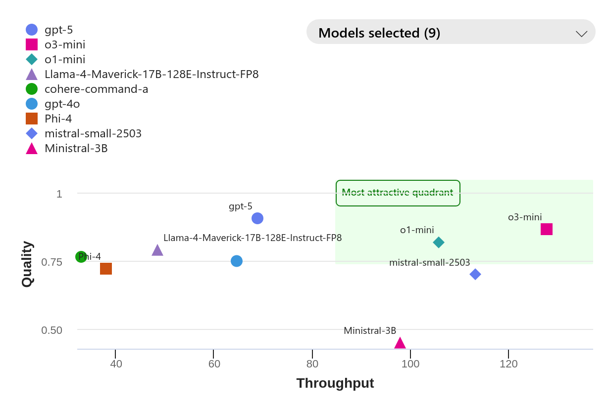

# Natural Language Processing

Group 22, NLP 2025, Fall.

[](https://classroom.github.com/a/hgNAtOO3)

Repository for the course project.

The group members: Berg, Mikkel Skafsgaard; Jehøj-Krogager, Nikolaj; Yildirim, Michel.

The dataset being used: SMOL

Department of Computer Science, Aarhus University, 2025.

We have provided a `env.yaml` to setup a proper Python environment to use in this project. To create it run

```sh
$ conda env create -f env.yaml
```

## Abstract (P2)

This project explores how factual inaccuracies in training data influence the reliability and reasoning of multi purpose
LLMs. Using the factuality annotated SmolDoc dataset from the SMOL project we investigate whether exposure to factually
incorrect text via various adaptation techniques (ICL, PEFT and SFT) can "poison" an LLM’s general capabilities like
question-answering. SmolDoc is a dataset with document-level translations from English to over 100 low-resource
languages with additional annotations on whether a document is factually correct or not. Our goal is to analyze how
models adapted for machine translation (MT), where factuality is not a concern, behave when later tasked with question
answering, where factuality is essential. The motivation comes from concerns that LLMs are being trained on generated,
factually incorrect or simply low-quality data that will internalize misinformation, leading to systematic flaws. We
show that tasks like MT can ripple errors into larger failures in reasoning and trust. By combining factuality-aware
data processing, question generation, and LLM-as-a-Judge evaluation, we aim to highlight the vulnerability of LLMs to
data quality issues and the critical need for factuality-aware training practices.

## Contributions and Novelty

The project contributes a systematic framework for evaluating factual inaccuracies in training data introduced by
adaptation techniques and how they might influence downstream reasoning in LLMs. While there is quite a bit of work on
detection of hallucination and how to mitigate it, few studies investigate the effects of exposure to factually
incorrect data during training on tasks that do not explicitly require factuality (such as MT) and how these errors
later affect tasks that do demand factual correctness (such as question answering). Our pipeline bridges this gap by
leveraging factuality annotations from SmolDoc in controlled adaptation experiments, where we train models on
low-resource language translations and then evaluate how factual inaccuracies in the training data affect their
downstream question-answering performance.

Our key novelty lies in combining factually annotated multilingual data, LLM-based question generation from this data,
and LLM-as-a-judge evaluation into a single pipeline. We introduce a reproducible benchmark to quantify the
contamination of truthness, essentially how exposure to misinformation during adaptation propagates through a model’s
layers (and reasoning, if available). Additionally, we aim to explore the effects of the model size, target language,
and adaptation strategy (ICL, PEFT and SFT) on factually incorrect data. Furthermore, we see if a model performs the
same regardless of the adaptation technique and whether on factuality-aware tasks the performance has degraded.

## Methods

We adapt models for document-level translations from SmolDoc, partitioning the data by factuality annotations (correct,
incorrect, mixed). We compare three model adaptation approaches: In-Context Learning (ICL), Supervised Fine-Tuning (
SFT), and Parameter-Efficient Fine-Tuning (PEFT) using LoRA. [Note: currently for P2 we have Proof of Concept with ICL]

For evaluation, we use slightly more powerful models to generate question-answer pairs from the SmolDoc documents that
probe factual content. Adapted models are then evaluated on these questions using LLM-as-a-Judge assessments (and F1
scores), with reasoning traces captured to identify failure patterns.

This setup allows us to measure how factual contamination during translation adaptation affects subsequent
question-answering performance across different model sizes, adaptation strategies, and target languages.

Models we have used (and will attempt) for the MT adaptation are models such as Gemma3:4b, DeepSeek-R1:8b and similar
models. The more powerful models we are planning to use for LLM-as-a-Judge and question generation will be models such
as GPT-5 nano and mini variants, where the goal is to use a model that is strong in terms of _instruction following_, _hard
prompts_, _semantics_ and general reasoning.

## Timeline and Milestones for P3

- [x] Refinement and improved baseline
    - [x] Add reasoning traces to question generation
    - [x] Refine evaluation prompts (no follow-up questions, concise answers)
    - [x] Re-run baseline: models without adaptation vs. with translation adaptation
- [ ] Adaptation strategy comparison - ICL vs. SFT vs. PEFT
    - [ ] Implement SFT and PEFT (LoRA) pipelines
    - [ ] Compare ICL vs. SFT vs. PEFT on existing model/language pairs
    - [ ] Evaluate using both True/False and 1-5 granular metrics
- [ ] Expanded Model Grid - Multiple model sizes and languages
    - [ ] Add more model sizes (e.g., 3B, 8B, 13B)
    - [ ] Test how model scale interacts with factual contamination across adaptation strategies
    - [ ] Expand to more target languages (different scripts/regions)
    - [ ] Run full grid: model sizes x languages x adaptation strategies x factuality conditions
- [ ] P3 Documentation
    - [ ] Analysis
    - [ ] Generate comparison plots across all experimental conditions

### Project Timeline

| Week       | Focus                            |
|------------|----------------------------------|
| **Week 1** | Baseline refinement              |
| **Week 2** | Adaptation strategy comparison   |
| **Week 3** | Expanded model and language grid |
| **Week 4** | Analysis and plots               |
| **Week 5** | Report writing                   |
| **Week 6** | Buffer & finalization            |

# Appendix

## Evaluation

### Evaluation Metric

**Granular (1–5 Scale)**

| Score | Description                                                  |
|-------|--------------------------------------------------------------|
| **1** | The answer is completely incorrect or irrelevant.            |
| **2** | The answer has significant inaccuracies or omissions.        |
| **3** | The answer is partially correct but lacks important details. |
| **4** | The answer is mostly correct with minor inaccuracies.        |
| **5** | The answer is completely correct and comprehensive.          |

**True / False Evaluation**

- **True:** The answer is factually correct.
- **False:** The answer is not factually correct.

---

### Evaluation – Data Exposure

- How does the model perform without the fake translation task?
    - Initial results indicate that it performs worse: However that is only because it asks questions to be more
      specific, which is then scored as very bad. The prompt should be refined such that
        - … ask no questions back
        - … give concise answer
- How does the model perform *with* the fake translation task?
    - *(Results and comparison to be added after evaluation.)*

---

### **Evaluation – Model**



## Update mirror

We develop on the AU GitLab instance. This course requires our work to be on
GitHub, so we have set up a mirror, but we need to manually push the changes.
We do not have access to the settings, such that it could be automated. On
e.g. Forgejo that is possible. You should be in the "extra" repository (see
[docs.github.com](https://docs.github.com/en/repositories/creating-and-managing-repositories/duplicating-a-repository#mirroring-a-repository-in-another-location)
for more information), which
in my case is `nlp_backup` and run

```
$ git fetch -p origin
$ git push --mirror
```
